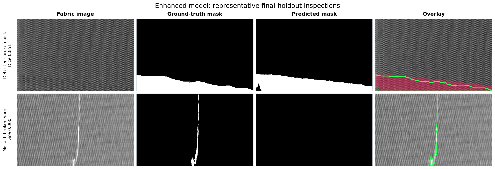

# Industrial Fabric Defect Inspection

This project finds defects in woven fabric and marks the affected pixels. Give it a grayscale
inspection image and the model returns a probability map showing where it believes a defect is
present. That makes it useful for two related tasks: warning that a roll may be defective and
showing an operator where to look.

I built the project around the public AITEX Fabric Image Database as a practical study of a much
larger problem: how far can a small, reproducible vision system get toward automated textile
inspection? The answer is encouraging, but honest. The latest model is a good research prototype;
it is not yet a replacement for a production quality-control system.

## Example inspection results



The model marks defects at pixel level. The first row shows a strong localisation; the second is
a difficult broken-yarn example that the model misses. In the overlays, pink is the predicted
defect area and the green outline is the human annotation. Each view is cropped from the original
long fabric strip so the defect remains visible on a GitHub page.

## Results at a glance

Phase 4 analysis showed that the first U-Net struggled with tiny defects, tile boundaries,
rotation, and recurring texture features on several fabrics. The enhanced pipeline responds to
those specific problems with smaller source crops, stronger augmentation, small-defect sampling,
hard-negative sampling, focal-plus-Dice loss, and overlapping weighted inference.

Because the original test set had already been examined during error analysis, I did not reuse it
to claim an improvement. Instead, I locked a new 38-image final holdout and trained a fresh
reference model and the enhanced model without those images.

| Final-holdout metric | Fresh reference | Enhanced model |
| --- | ---: | ---: |
| Dice | 0.2589 | **0.5321** |
| IoU | 0.1487 | **0.3625** |
| Pixel precision | 0.1576 | **0.3820** |
| Pixel recall | 0.7246 | **0.8765** |
| Image precision | **0.7778** | 0.6875 |
| Image recall | 0.4375 | **0.6875** |
| Image-level F1 | 0.5600 | **0.6875** |
| Image-level ROC-AUC | 0.7074 | **0.8778** |

Dice and IoU measure how closely the predicted defect area overlaps the annotation; higher is
better. Pixel recall measures how much of the annotated damage was found. Image-level F1 balances
missed defective images against false alarms.

The enhanced model more than doubled Dice and reduced missed defective images from nine to five.
It also raised false alarms from two images to five, so its stronger recall comes with a real
operational trade-off. The [final report](docs/enhanced_final_results.md) contains the complete
comparison, and the [evaluation protocol](docs/enhanced_evaluation_protocol.md) explains how the
replacement holdout was protected.

## Project motivation

This independent portfolio project was inspired by a public Upwork specification posted in
September 2026 for a camera-based fabric defect detection system for industrial textile
inspection. The implementation uses public data and was not commissioned by or affiliated with
the original client.

Original freelance specification: [Fabric Defect Detection System Development on Upwork](https://www.upwork.com/freelance-jobs/apply/Fabric-Defect-Detection-System-Development_~022097042475088688180/)

## What is in the repository?

The work covers the complete experiment, not just model training:

- dataset download, integrity checks, mask matching, and duplicate checks;
- source-image-level splitting so patches from one image cannot leak across splits;
- a classical texture baseline to establish a meaningful lower bound;
- a compact U-Net with a pretrained ResNet-18 encoder;
- validation-only checkpoint and threshold selection;
- full-resolution tiled inference and pixel-level reconstruction;
- error analysis across defect size, fabric type, and controlled image perturbations;
- a second, locked evaluation protocol for testing the improvements fairly.

The dataset and trained checkpoints are intentionally excluded from Git. They are reproducible
locally, while the code, configurations, split lock, metrics, and reports are versioned.

## How the model works

AITEX images are long, narrow strips, while the network expects square inputs. During training,
the pipeline cuts each strip into crops after the source images have been assigned to a split.
Positive crops are sampled more often because defect pixels make up well below one percent of the
dataset.

The enhanced model views a 128 x 128 source region enlarged to 256 x 256. This gives very small
defects more pixels inside the network. At inference time, neighbouring tiles overlap by 50% and
are blended with centre weighting. The overlap avoids abrupt seams and gives each location more
than one view. A U-Net decoder then combines fine spatial detail with features from the ResNet-18
encoder to produce one defect probability per pixel.

## Set up the environment

The project was developed with Python 3.12 on Windows and an NVIDIA RTX 5070 Ti. Training requires
CUDA; evaluation can run on a CPU, although it will be slower.

```powershell
py -3.12 -m venv .venv
.\.venv\Scripts\Activate.ps1
python -m pip install --upgrade pip
python -m pip install torch==2.14.0+cu130 torchvision==0.29.0+cu130 `
  --index-url https://download.pytorch.org/whl/cu130
python -m pip install -e ".[dev]"
```

If your GPU needs a different PyTorch build, install the matching official build first and then
install this project. All remaining dependencies stay inside `.venv`.

## Reproduce the experiments

Download and prepare the official AITEX data:

```powershell
python scripts/prepare_dataset.py --download
```

Run the original study:

```powershell
python scripts/run_baseline.py --config configs/baseline.yaml
python scripts/train.py --config configs/unet.yaml
python scripts/evaluate.py --config configs/evaluation.yaml --select-thresholds
python scripts/evaluate.py --config configs/evaluation.yaml --evaluate-test
python scripts/analyze.py --config configs/analysis.yaml
```

Materialise the locked enhanced split and reproduce the matched models:

```powershell
python scripts/prepare_enhanced_protocol.py
python scripts/train.py --config configs/unet_reference_v2.yaml
python scripts/train.py --config configs/unet_enhanced_v2.yaml
python scripts/evaluate.py --config configs/evaluation_reference_v2.yaml --select-thresholds
python scripts/evaluate.py --config configs/evaluation_enhanced_v2.yaml --select-thresholds
```

The final-holdout commands are intentionally not part of the routine workflow. Its results are
already committed, and repeatedly using that split for model decisions would turn it into another
development set.

Run the checks with:

```powershell
python -m pytest
ruff check src tests scripts
python -m pip check
```

## Project layout

```text
configs/                 Experiment and evaluation settings
data/README.md           Dataset source and preparation notes
docs/                    Audit, experiment, and result reports
results/                 Versioned metrics and figures
scripts/                 Command-line entry points
src/fabric_inspection/   Data, model, training, inference, and evaluation code
tests/                   Focused unit tests for the pipeline
```

## Is it ready for a factory line?

Not yet. On the clean final holdout, the model still misses 5 of 16 defective images and produces
5 false alarms among 22 normal images. AITEX is also too small and controlled to represent new
looms, cameras, lighting, fabric lots, line speeds, and defect policies.

The next serious step is to collect images from the intended production setup, keep fabric lots
separate during evaluation, label more microscopic defects, measure throughput, and choose an
operating threshold from the real cost of a missed defect versus a false stop. In its current
form, the system is best viewed as a strong research or portfolio project and a promising
human-in-the-loop inspection aid.

## Reports

- [Dataset audit](docs/dataset_audit.md)
- [Classical baseline](docs/baseline_results.md)
- [U-Net training](docs/training_results.md)
- [Initial held-out evaluation](docs/evaluation_results.md)
- [Error and robustness analysis](docs/error_robustness_analysis.md)
- [Enhanced validation results](docs/enhanced_validation_results.md)
- [Enhanced final results](docs/enhanced_final_results.md)
- [Suggested GitHub metadata](docs/repository_metadata.md)

This is independent work inspired by a real-world textile-inspection brief. It was not
commissioned by, or produced for, the original client.
