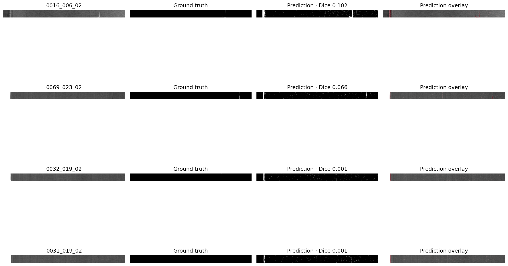

# Phase 1: classical baseline

The baseline is deliberately training-free and lightweight. It combines two
signals computed from each grayscale image:

1. local tone deviation between narrow and broad Gaussian scales;
2. local high-frequency texture energy.

Each signal is converted to a robust row-wise z-score using the median absolute
deviation. Their maximum is thresholded, gaps are closed morphologically, and
connected responses smaller than 24 pixels are removed. This establishes a
transparent lower bound rather than attempting to compete with the segmentation
network planned for Phase 2.

## Selection protocol

The pixel threshold was chosen by validation Dice from the fixed candidates in
`configs/baseline.yaml`. The image-level area threshold was then chosen by
validation F1 from every distinct validation operating point, breaking ties by
recall. The resulting thresholds—2.5 for pixel scores and 0.0227528 for predicted
area—were frozen before the final test evaluation.

## Results

| Split | Dice | IoU | Pixel precision | Pixel recall |
| --- | ---: | ---: | ---: | ---: |
| Validation | 0.0625 | 0.0322 | 0.0379 | 0.1775 |
| Held-out test | 0.0129 | 0.0065 | 0.0065 | 0.5708 |

| Split | Accuracy | Precision | Recall | F1 | ROC-AUC |
| --- | ---: | ---: | ---: | ---: | ---: |
| Validation | 0.6486 | 0.5600 | 0.8750 | 0.6829 | 0.6190 |
| Held-out test | 0.5263 | 0.4286 | 0.3750 | 0.4000 | 0.5994 |

The held-out image-level confusion matrix is `[[14, 8], [10, 6]]` in
`[[TN, FP], [FN, TP]]` layout.

These weak results are informative: simple local statistics respond strongly to
normal weave changes and fixed acquisition features while missing extremely
small, low-contrast defects. The difference between validation and test Dice is
also affected by defect scale: the validation split contains substantially more
annotated defective pixels. No thresholds or parameters were changed using the
test results.



Reproduce the experiment after dataset preparation with:

```powershell
python scripts/run_baseline.py --config configs/baseline.yaml
```

Detailed threshold searches, per-image predictions, metrics, and the generated
figure are written locally to `results/baseline/`.

