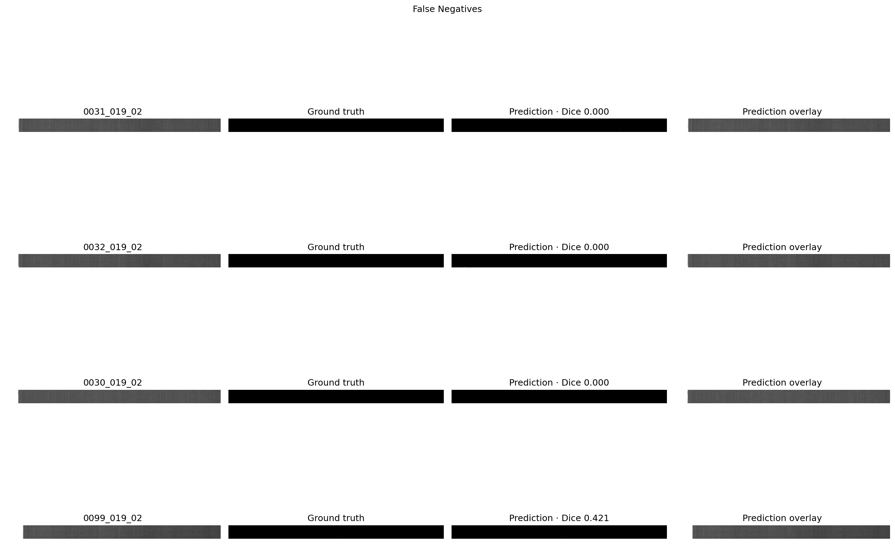
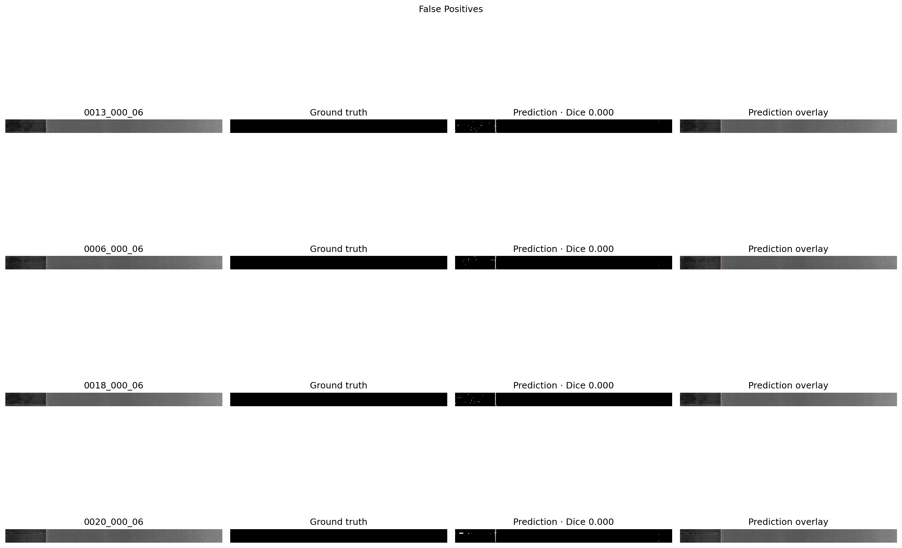
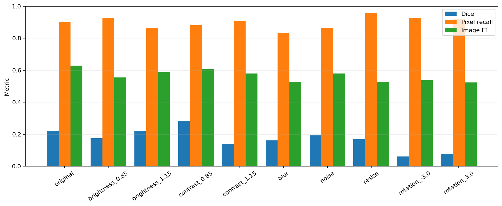

# Phase 4: error and robustness analysis

All analyses use the Phase 3 checkpoint and validation-frozen thresholds without
retuning. The model is evaluated at original-image resolution.

```powershell
python scripts/analyze.py --config configs/analysis.yaml
```

## Error analysis

Defect size is the clearest failure factor. Spearman correlation between log
annotated area and per-image Dice is **0.762** (`p = 0.0006`). Contrast and
horizontal/vertical location correlations are not statistically persuasive in
this small test sample.

| Ground-truth size | Images | Mean Dice | Image recall |
| --- | ---: | ---: | ---: |
| Tiny, 1–32 pixels | 6 | 0.0710 | 0.1667 |
| Small, 33–256 pixels | 2 | 0.0063 | 1.0000 |
| Medium, 257–4096 pixels | 8 | 0.3886 | 1.0000 |

All five image-level false negatives are **fuzzyball defects on fabric 02** with
only 10–20 annotated pixels. One of these overlaps well enough for Dice 0.421,
but its predicted component remains below the image-decision size threshold.
Thus the current image rule is poorly calibrated for microscopic defects.

Four of eight false positives are normal fabric 06 images; two are fabric 01 and
two are fabric 04. Visual inspection shows repeated responses around a stable
vertical acquisition/fabric feature and patch-local texture responses. This is a
systematic hard-negative problem rather than random noise.





## Controlled robustness

Perturbations are moderate and deterministic: ±15% brightness, ±15% contrast,
Gaussian blur (`σ=1.2`), Gaussian noise (`σ=5/255`), 75% downsample/upsample, and
±3° rotation. Photometric transforms preserve the mask; rotation transforms the
image and mask together. Frozen thresholds are used in every condition.

| Condition | Dice | Δ Dice | Pixel recall | Image F1 | Δ Image F1 |
| --- | ---: | ---: | ---: | ---: | ---: |
| Original | 0.2225 | — | 0.9005 | 0.6286 | — |
| Brightness −15% | 0.1748 | −0.0476 | 0.9285 | 0.5556 | −0.0730 |
| Brightness +15% | 0.2200 | −0.0025 | 0.8644 | 0.5882 | −0.0403 |
| Contrast −15% | 0.2829 | +0.0604 | 0.8808 | 0.6061 | −0.0225 |
| Contrast +15% | 0.1398 | −0.0827 | 0.9089 | 0.5789 | −0.0496 |
| Blur | 0.1615 | −0.0610 | 0.8354 | 0.5294 | −0.0992 |
| Noise | 0.1922 | −0.0303 | 0.8668 | 0.5789 | −0.0496 |
| Resize to 75% and back | 0.1676 | −0.0548 | 0.9603 | 0.5263 | −0.1023 |
| Rotation −3° | 0.0603 | −0.1621 | 0.9265 | 0.5366 | −0.0920 |
| Rotation +3° | 0.0777 | −0.1448 | 0.9185 | 0.5238 | −0.1048 |



Rotation is the dominant weakness, reducing Dice by 0.145–0.162. High contrast,
blur, and resampling also produce meaningful degradation. Reduced contrast
improves micro Dice while lowering image F1 slightly, supporting the observation
that normal high-frequency weave/acquisition features drive many false-positive
pixels. High pixel recall remains present under most corruptions, but often by
predicting excessive area; it is not evidence of robust localisation by itself.

## Highest-impact strengthening plan

The following sequence targets measured failures rather than adding model
complexity indiscriminately.

1. **Protect future evaluation.** Phase 4 has now consumed the original test set
   for diagnosis. Any improved model should be developed with grouped repeated
   validation or grouped cross-validation, then judged on a newly reserved or
   external final holdout. Reusing this test set to claim improvement would be
   optimistic.
2. **Build a dedicated tiny-defect path.** Generate defect-centred training crops
   only after source splitting, jitter their centres, and add a 128-pixel
   high-resolution scale alongside the 256-pixel context scale. Use multi-scale
   sliding inference so 10-pixel fuzzyballs occupy a learnable proportion of the
   input. Track object-level sensitivity and macro defect Dice, not only micro
   Dice.
3. **Mine hard negatives and balance fabrics.** Run the frozen model over normal
   training images, collect its strongest false-positive regions—especially the
   recurrent feature on fabrics 06, 01, and 04—and oversample those crops during
   retraining. Fabric-balanced batches prevent common textures from dominating.
   If the vertical feature is outside the valid inspection surface, define that
   camera ROI explicitly rather than asking the model to classify it.
4. **Replace seam-prone tiling.** Train with randomly positioned crops and infer
   with 50% overlap plus centre-weighted blending. This removes hard 256-pixel
   boundaries and should help the severe rotation/resampling sensitivity.
5. **Match augmentation to measured shifts.** Add orientation sampling across
   at least ±5°, blur up to `σ=1.5`, the tested noise level, resampling, and wider
   contrast exposure. Pair this with per-image or per-fabric illumination
   normalisation. Validate each addition through grouped ablation rather than
   stacking transformations without evidence.
6. **Use a small-object-aware objective.** Compare focal BCE + Dice or focal
   Tversky against the current weighted BCE + Dice, and weight images/instances
   so a large defect cannot dominate threshold selection. Select using a
   declared combination of macro Dice and defect recall.
7. **Only then compare one architecture.** A lightweight DeepLabV3+ or
   SegFormer-B0 can test whether multi-scale context improves results. Architecture
   expansion should follow the data, sampling, and tiling corrections above.
8. **Acquire representative data.** Industrial-grade performance ultimately
   requires examples from the intended camera, loom, lighting, speeds, fabrics,
   and acceptable-defect policy. The public benchmark cannot validate that
   domain shift.

The first four interventions are the most likely to yield a significant gain:
they directly address every observed false negative, half the false positives,
and the dominant geometric robustness failure.

