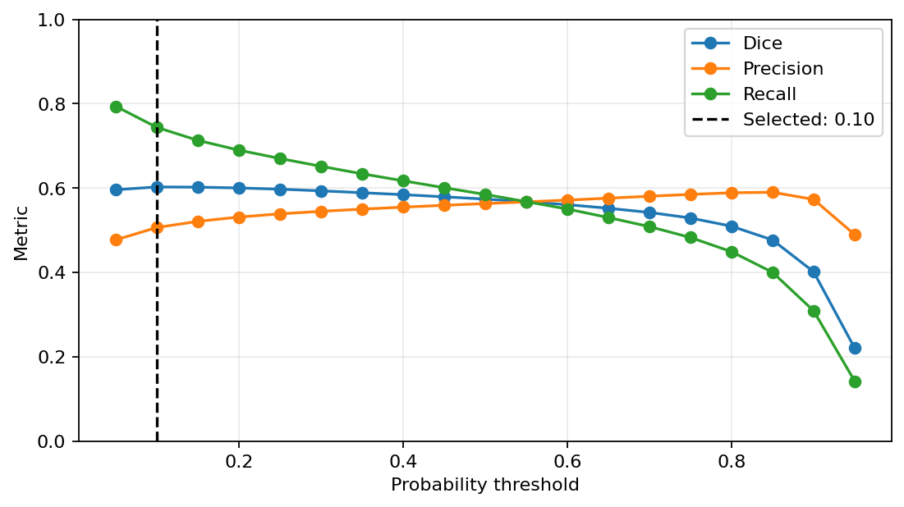
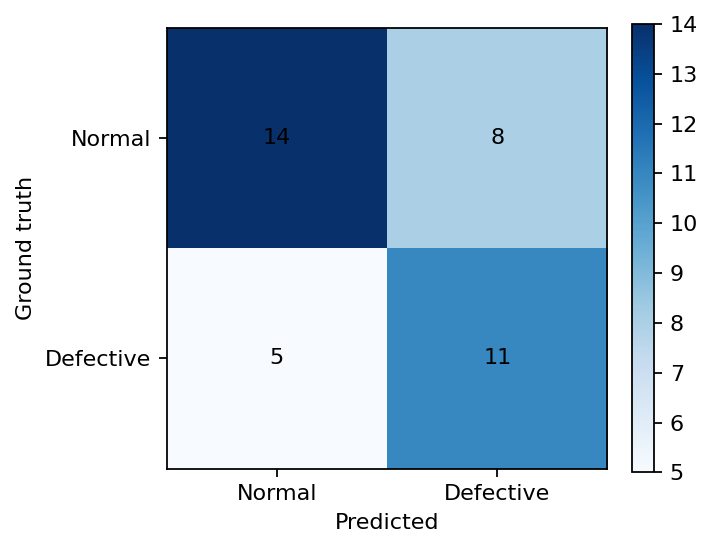

# Phase 3: held-out evaluation

Phase 3 evaluates the epoch-4 U-Net checkpoint selected in Phase 2. Patch
probabilities are reconstructed into each original 4096 × 256 image (3796 × 256
for the one shorter source) before metrics are calculated.

## Frozen selection protocol

The two evaluation stages are deliberately separate:

```powershell
python scripts/evaluate.py --config configs/evaluation.yaml --select-thresholds
python scripts/evaluate.py --config configs/evaluation.yaml --evaluate-test
```

The first command accesses only validation images. It selected probability
threshold `0.10` by micro Dice, then selected a largest-connected-component area
fraction of `0.000374794` by image-level F1 with recall as the first tie-breaker.
It saved both thresholds with the checkpoint SHA-256. The second command refused
to run if that checkpoint had changed, then applied the frozen settings to the
test split once. No parameter was selected or changed from test results.

## Results

| Split | Dice | IoU | Precision | Recall | Macro defect Dice |
| --- | ---: | ---: | ---: | ---: | ---: |
| Validation | 0.6025 | 0.4312 | 0.5063 | 0.7439 | 0.1838 |
| Held-out test | 0.2225 | 0.1252 | 0.1269 | 0.9005 | 0.2217 |

| Split | Accuracy | Precision | Recall | F1 | ROC-AUC |
| --- | ---: | ---: | ---: | ---: | ---: |
| Validation | 0.8108 | 0.7368 | 0.8750 | 0.8000 | 0.8244 |
| Held-out test | 0.6579 | 0.5789 | 0.6875 | 0.6286 | 0.6918 |

The held-out confusion matrix is `[[14, 8], [5, 11]]` in
`[[TN, FP], [FN, TP]]` layout.





## Interpretation

Compared with the classical baseline on the identical test split, U-Net raises
Dice from 0.0129 to 0.2225, IoU from 0.0065 to 0.1252, and image-level F1 from
0.4000 to 0.6286. Pixel recall reaches 0.9005, which is useful for a
recall-oriented inspection setting, but precision remains only 0.1269 and eight
normal images trigger false alarms.

The validation micro Dice is influenced by a small number of large defects, as
shown by its much lower macro defect Dice. Conversely, the held-out set contains
only 10,803 annotated defect pixels and many extremely small fuzzyball masks.
Fuzzyball test Dice is 0.0063, while broken yarn reaches 0.5400. These scale and
category effects explain much of the validation/test difference and remain a
major limitation for Phase 4 analysis.

