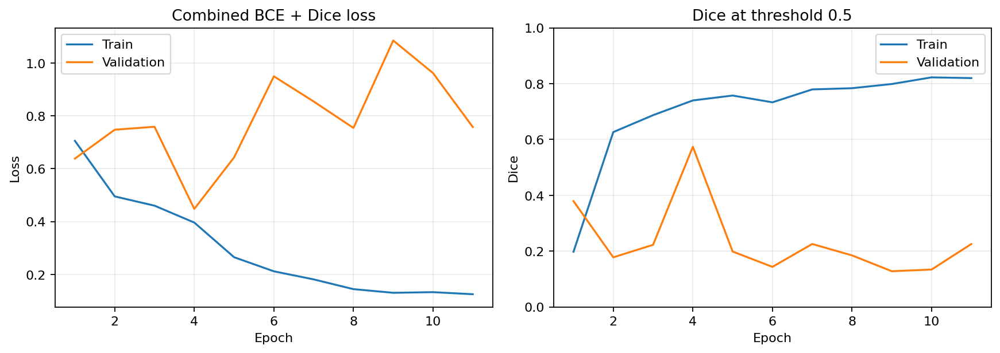

# Phase 2: U-Net training

The primary model is a U-Net with an ImageNet-pretrained ResNet-18 encoder and a
small convolutional decoder. It produces one binary-defect logit per input pixel.

## Methodological decisions

- Original-image assignments from Phase 0 remain immutable. Patches inherit
  those assignments and cannot cross splits.
- A 256 × 256 input preserves the source image height. The single 212-pixel-wide
  edge patch is reflect-padded rather than discarded.
- The one defective source image without a mask is excluded from segmentation
  training but retained in the source manifest for later image-level analysis.
- Only 134 of 2,735 usable training patches contain annotated pixels. Weighted
  sampling targets a 50/50 positive/negative patch mixture without duplicating
  data on disk.
- Paired augmentation uses flips, rotations within ±7°, mild brightness and
  contrast changes, and slight Gaussian noise. Validation has no stochastic
  augmentation.
- The objective is equally weighted BCE-with-logits and Dice loss. BCE uses a
  positive-pixel weight of 25 to address foreground imbalance.
- Best-checkpoint selection uses validation Dice at a fixed diagnostic threshold
  of 0.5. Final threshold selection is deferred to Phase 3 and the held-out test
  split has not been evaluated.

## Training run

The fixed-seed run used Python 3.12.13, PyTorch 2.14.0 with CUDA 13.0, mixed
precision, and an NVIDIA RTX 5070 Ti. Training stopped after 11 epochs because
validation Dice had not improved for seven epochs. The best checkpoint was epoch
4:

| Metric | Train | Validation |
| --- | ---: | ---: |
| Combined loss | 0.3963 | 0.4480 |
| Dice at 0.5 | 0.7398 | 0.5738 |
| IoU at 0.5 | 0.5870 | 0.4023 |

The widening train/validation gap after epoch 4 indicates overfitting, expected
with the small and heterogeneous dataset. Early stopping correctly preserved the
earlier checkpoint. Phase 3 will tune the segmentation and image-decision
thresholds exclusively on validation predictions before evaluating the test set.
